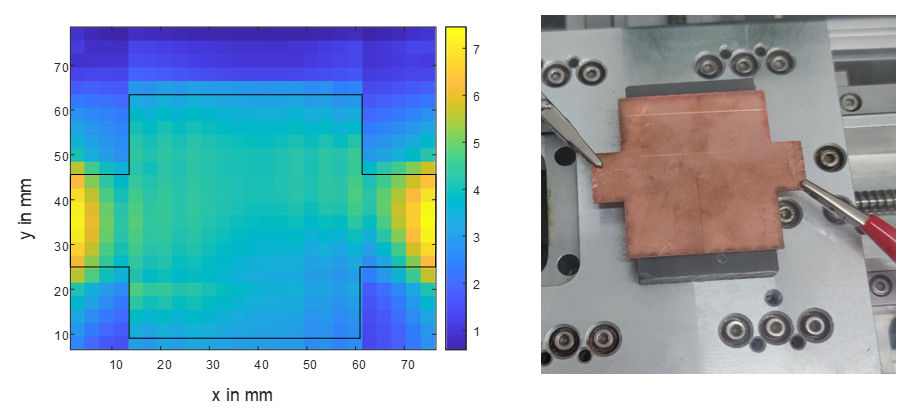
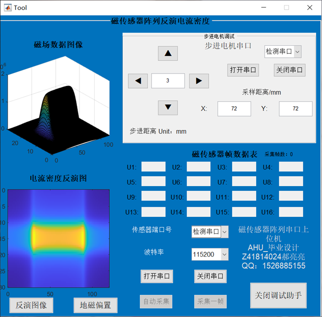

# **AHU-2022 本科毕业设计**
---
本项目使用磁传感器采集电流源周围空间磁场，然后通过空域傅里叶变换算法进行反演，得到电流重构 
其中磁传感器采用TMR2001，16路磁传感器阵列使得扫描更加快捷,两片AD7606完成模数转换功能，主控芯片为STM32F103VETX.
采样数据通过串口返回上位机，反演算法在MATLAB上实现，制作了GUI界面方便调试 
增加了自动采样功能，使用另一块STM32F103控制步进电机作X-Y方向等间隔采样 
下面是最后实验装置和结果图: 

## 关于硬件电路
>存放在hardware内

共两块电路板，分为主控和传感器电路板，两块电路板通过预留的排座相连,主控板中使用USB接口完成供电和串口通信两个功能,AD620作放大芯片，供电电压为±15V 
下图是传感器电路板： 

>这里阵列传感器间隔为10mm，实际上应该尽可能小，比如3mm，否则分辨率不够，根据香农采样定理无法还原原始电流分布

## 关于MCU的程序设计
项目采用HAL库+CUBEMAX开发，主控板上AD7606采用SPI协议通信，本项目采用的是软件模拟SPI，当串口接收到字符'c'时采集一帧数据 
电机控制MCU上使用串口命令控制移动，自定义了简单的命令格式，使用'f'、'b'、'l'、'r'+移动距离+' '作为一帧有效命令，只有接收到' '才被认为是有效命令进行处理

## 关于GUI

 
>GUI采用MATLAB中路的GUIDE制作，并未采用新版APP DESIGNER，因为会涉及到一些不兼容的问题

使用方法：先手动将X-Y移动平台设置到电流源的右上角，再分别打开两个串口，设置采样间隔和采样距离，其中采样距离应要求能覆盖整个电流源

